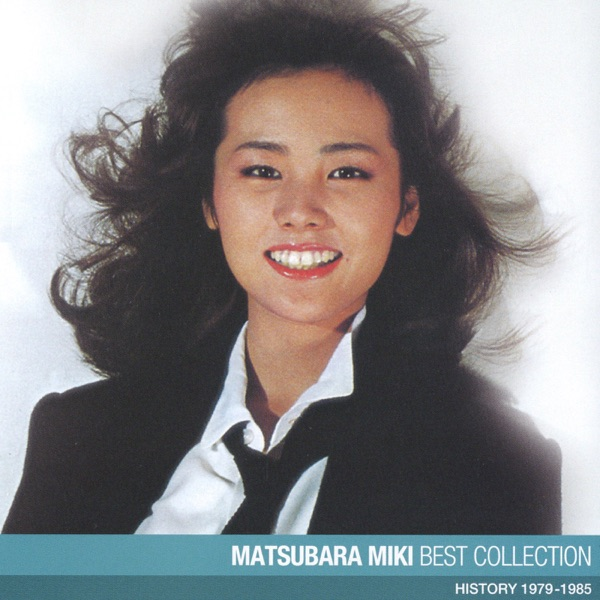

# Mayonaka No Door ~Stay with Me — Miki Matsubara

**Album:** Pocket Park
**Accent:** `#bb907a`

## Charge

<!-- What state does this song trigger? -->

## Sonical Attraction

<!-- What sound detail pulls you in? Rhythm, bass, vocal texture, distortion, switch, silence. -->
I lose a bit of conscious at the third minute mark when the saxophone solo kicks in, then I totally transcend at the end with the synth + brass mix

## Lyric/Vocal Detail

<!-- Any line, delivery, breath, pronunciation, or vocal moment worth preserving? -->

## Version of ulaş

<!-- What version of me does this song store? Time period, grind, breakup, desire, motion. -->

## Lore

<!-- Any personal history, repeated use, place, habit, person attached to this track? -->

## Reading

<!-- What do I think the song is doing or narrating? -->

## Comment

<!-- Free field. Final take, vibe, joke, conclusion, or whatever does not fit elsewhere. -->
this song goes extra hard if I'm driving at twice the speed limit, virtually
