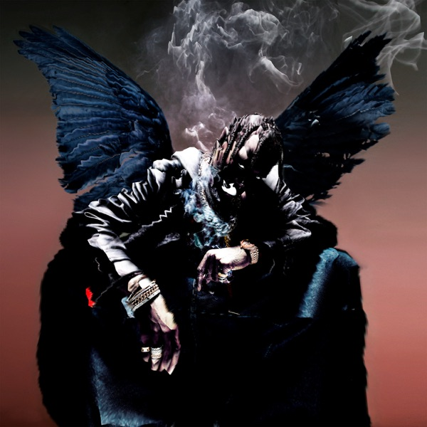

# Through the Late Night — Travis Scott

**Album:** Birds In The Trap McKnight
**Accent:** `#925b56`

## Charge

## Sonical Attraction

## Lyric/Vocal Detail

It's dense, yet very simple. The layered bassline is what works in its favor, 

## Version of ulaş

## Lore

This song was part of an experiment to defeat the sleepiness that comes with beginning to study. I made it so this was the song that I put on repeat as I began coding. And it seems to have worked, but the cost of it all was that I no longer could listen to this track and waste its neurological potential

## Reading

## Comment

