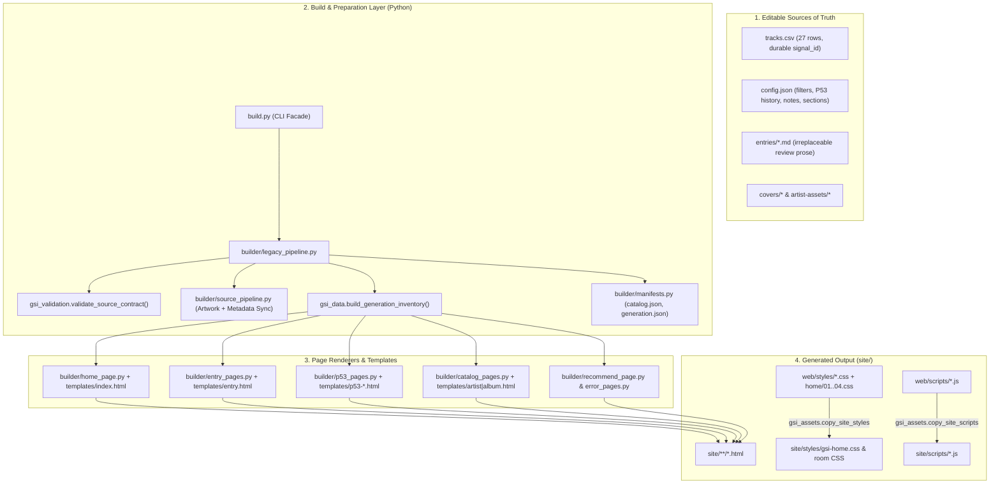

# GSI Structural Audit & Architecture Map

**Date:** 2026-09-22  
**Mode:** Strictly Read-Only (No source, configuration, prose, or generated files modified)  
**Scope:** End-to-end code topology, data contracts, rendering pipeline, client-side state/style architecture, validation guardrails, and structural observations ahead of the localhost UX/visual audit.

---

## 1. Executive Summary & Architectural State

GSI (**Genome Stability Inducers**) has transitioned from its pre-1.0 monolithic string-interpolation script into a staged, modular static generator while preserving backward compatibility for CLI invocations and test imports.



### Key Inventory Counts (from `site/data/generation.json` & `config.json`)
| Entity | Count | Authority / Location |
| :--- | :---: | :--- |
| **Authored Track Rows** | `27` | `tracks.csv` (`sig-...` primary identity) |
| **Radio P53 Transmissions** | `18` | `config.json` → `p53_history` (`20` generated files in `site/p53/` including `index.html` & `latest.html`) |
| **Generated Entry Rooms** | `27` | `site/entries/*.html` (1:1 with `entries/*.md`) |
| **Generated Artist Rooms** | `28` | `site/artists/*.html` (unions `tracks.csv` + `p53_only` artists) |
| **Generated Album Rooms** | `35` | `site/albums/*.html` (grouped by `(artist, album)` across merged archive) |
| **Active Filter Rooms** | `8` | `personal`, `bassline`, `ulas`, `dreamy`, `bite`, `pop`, `distortion`, `p53` |
| **Review Sections** | `7` | `Charge`, `Sonical Attraction`, `Lyric/Vocal Detail`, `Version of ulaş`, `Lore`, `Reading`, `Comment` |

---

## 2. Module Ownership & Code Boundaries

### 2.1 Entry Point & Orchestration
- **[build.py](file:///c:/Users/Kane/Desktop/Metu_Undergrad/Y3/GSI/build.py):** Minimal 13-line facade that re-exports [builder/legacy_pipeline.py](file:///c:/Users/Kane/Desktop/Metu_Undergrad/Y3/GSI/builder/legacy_pipeline.py) so legacy CLI flags (`--site-only`, `--validate-links`, `--audit-provider-links`) and test imports remain unbroken.
- **[builder/legacy_pipeline.py](file:///c:/Users/Kane/Desktop/Metu_Undergrad/Y3/GSI/builder/legacy_pipeline.py):** Enforces the strict 5-step execution order:
  1. **Preflight Validation:** Calls `validate_source_contract()` before touching any file or making network calls.
  2. **Source Preparation:** Runs `build_entries()`, `prepare_p53_history()`, `merge_p53_into_archive()`, and derives the single shared route map via `build_generation_inventory()`.
  3. **Asset & Manifest Synchronization:** Copies `covers/`, `artist-assets/`, `web/scripts/`, assembles `web/styles/home/*.css` into `site/styles/gsi-home.css`, copies `tools/editor/`, and writes `site/data/{catalog,generation,artists}.json`.
  4. **Stale Output Reconciliation:** `reconcile_generated_outputs()` removes orphaned HTML files in `site/{entries,artists,albums}/` while explicitly protecting permanent historical `site/p53/<slug>.html` routes.
  5. **Page Rendering & Post-Build Link Validation:** Renders all 8 template families and optionally runs `validate_generated_links(SITE_DIR)`.

### 2.2 Domain & Data Modules (`gsi_*.py`)
- **[gsi_data.py](file:///c:/Users/Kane/Desktop/Metu_Undergrad/Y3/GSI/gsi_data.py):** Path-agnostic data loader. Implements:
  - `current_p53_record()` / `current_p53_slug()`: Resolves the active P53 transmission by `p53_current_signal_id` (`sig-cad08a62f820d0cf19f2`) first, falling back to `p53_current_slug` (`matt-maeson-stubborn-as-religion`).
  - `ordered_tracks()`: Honors numeric `order` values (`1, 2, 3, 4...`) when present, sorting unordered rows (`999999`) behind ordered ones, or reversing when `newest_first` is active and no manual order exists.
  - `artist_room_groups()`: Merges full `tracks.csv` entries with `p53_only` signals so every artist in the ecosystem receives a navigable `site/artists/<slug>.html` room.
  - `build_generation_inventory()`: Single source of route truth consumed by both page builders and `generation.json`.
- **[gsi_assets.py](file:///c:/Users/Kane/Desktop/Metu_Undergrad/Y3/GSI/gsi_assets.py):** Owns the PIL-based perceptual color engine (`dominant_color()`, `artwork_palette()`, `compact_rim_gradient()`, `palette_style()`).
  - Samples 96×96 quantized covers, extracts `primary` and contrasting `secondary` hues in HSV space, samples a 28% lower-edge band (`_artwork_field_color`) and 12% perimeter bands (`_artwork_edge_colors`), and computes WCAG relative luminance contrast ratios (`_contrast_ratio`, `_best_ink`) so both light-mode and dark-mode surfaces guarantee readable copy (`--art-light-ink`, `--art-dark-ink`, `--art-section-ink`).
  - Differentiates full 32-point radial perimeter gradients (`_artwork_rim_gradient` for hero rooms) from low-cost 4-stop gradients (`compact_rim_gradient` for cards and P53 items) to prevent GPU/paint bottlenecks.
- **[gsi_validation.py](file:///c:/Users/Kane/Desktop/Metu_Undergrad/Y3/GSI/gsi_validation.py) & [tools/overnight_audit.py](file:///c:/Users/Kane/Desktop/Metu_Undergrad/Y3/GSI/tools/overnight_audit.py):**
  - Enforces schema integrity (`TRACK_COLUMNS`, `SIGNAL_ID_PATTERN = ^sig-[a-z0-9]{20,64}$`, hex color syntax, slug collision detection, path traversal protection via `_safe_source_path`).
  - Validates that `p53_current_slug` and `p53_current_signal_id` point to the final item of `p53_history`.
  - Inspects every generated HTML file to verify all local `href`, `src`, and `data-*-base-href` attributes resolve, and that every `` declares explicit `loading="eager|lazy"` and `decoding="async"`.

---

## 3. Browser Layer: Templates, CSS Cascade & JS State Machine

### 3.1 HTML Templates (`templates/*.html`)
Templates use explicit `@@TOKEN@@` markers replaced by [builder/template_renderer.py](file:///c:/Users/Kane/Desktop/Metu_Undergrad/Y3/GSI/builder/template_renderer.py) (which raises a hard `ValueError` if any `@@...@@` marker remains unreplaced or if unknown keys are supplied).
- **JSON Data Islands:** Instead of duplicating config data in JS files, pages embed `<script type="application/json">` islands (`#gsi-filter-data` on `index.html`, `#entry-context` on `entry.html`, `#p53-context` on `p53-transmission.html`, `#artist-room-data` on `artist.html`).

### 3.2 Client-Side State & URL Synchronization (`web/scripts/*.js`)
- **[gsi-context.js](file:///c:/Users/Kane/Desktop/Metu_Undergrad/Y3/GSI/web/scripts/gsi-context.js):** Shared state spine across all pages. Preserves `?filter=...&view=...&format=...&theme=...` across internal navigation (`[data-base-href]`, `[data-artist-base-href]`, `[data-album-base-href]`) while stripping transient UI parameters when generating canonical share URLs (`canonicalHref()`).
- **Homepage Modular Controllers:**
  - [home-page.js](file:///c:/Users/Kane/Desktop/Metu_Undergrad/Y3/GSI/web/scripts/home-page.js): Wires state and runs `syncContext()` using `history.replaceState`.
  - [home-layout.js](file:///c:/Users/Kane/Desktop/Metu_Undergrad/Y3/GSI/web/scripts/home-layout.js): Manages `body[data-view="poster|wall|gallery"]` and persists the layout choice to `localStorage("gsi-view")` with safe try/catch fallbacks.
  - [home-format.js](file:///c:/Users/Kane/Desktop/Metu_Undergrad/Y3/GSI/web/scripts/home-format.js): Toggles `body[data-format="songs|albums"]` and dynamically constructs `.filter-album-group` pockets in the DOM without destroying the underlying `.card` nodes.
  - [home-filters.js](file:///c:/Users/Kane/Desktop/Metu_Undergrad/Y3/GSI/web/scripts/home-filters.js): Drives the **Filter Room Transition** (`body.filter-active`, `body[data-active-filter="..."]`, `--page-tint`, dynamic `BA...SSLINE` width-responsive typography, `POP` floating signals, and the Apple Music playlist card).
- **[theme-mode.js](file:///c:/Users/Kane/Desktop/Metu_Undergrad/Y3/GSI/web/scripts/theme-mode.js):** Loaded synchronously in `<head>` across all templates so `document.documentElement.dataset.gsiTheme` is applied before first paint (preventing dark/light flash).

### 3.3 Stylesheet Topology (`web/styles/`)
- **Homepage Concatenation:** `gsi_assets.copy_site_styles()` concatenates 4 ordered layers in `web/styles/home/` into `site/styles/gsi-home.css`:
  1. `01-foundation.css` (reset, typography, atmospheric background, hero wordmark)
  2. `02-hero-and-filter-room.css` (hero grid, P53 broadcast card, filter-room expansion/collapse)
  3. `03-filter-and-controls.css` (filter buttons, layout/format switches, mini-playlist card)
  4. `04-cards-and-responsive.css` (`poster`/`wall`/`gallery` card geometries, album pockets, `@media` breakpoints, `prefers-reduced-motion`)
- **Cross-Cutting Theme Layer:** [theme-mode.css](file:///c:/Users/Kane/Desktop/Metu_Undergrad/Y3/GSI/web/styles/theme-mode.css) (`50.9 KB`) is loaded last on every route to map `--art-*` custom properties onto light and dark room recipes.

---

## 4. Concrete Structural Observations & Edge Cases (For Review)

During this static code inspection, four specific structural behaviors stood out that will directly inform our upcoming localhost UX/visual audit:

### Observation A: Homepage `ALBUMS` Format Hides Single-Signal Albums
- **Where:** [web/scripts/home-format.js](file:///c:/Users/Kane/Desktop/Metu_Undergrad/Y3/GSI/web/scripts/home-format.js#L51-L63)
- **Mechanism:** When the user switches the homepage format toggle from `SONGS` to `ALBUMS`:
  1. Lines 56–59 hide **every** song card (`card.style.display = "none"; card.dataset.albumPocketHidden = "true";`).
  2. Line 63 checks `if (!firstMatchingCard || groupCards.length < 2) return;` before creating a `.filter-album-group` summary card.
- **UX Impact to Verify on Localhost:** Out of the 35 albums in `generation.json`, only a few albums currently have $\ge 2$ represented signals (e.g., Metric — *Live It Out* [3], Beach House — *Bloom* [2], Royal Blood — *Royal Blood* [2]). All other albums with 1 signal disappear completely when `ALBUMS` format is clicked, rather than either appearing as 1-signal album cards or remaining visible.

### Observation B: Comment vs. Code Divergence in Artist Room Album Grouping
- **Where:** [builder/catalog_pages.py](file:///c:/Users/Kane/Desktop/Metu_Undergrad/Y3/GSI/builder/catalog_pages.py#L55-L100)
- **Mechanism:**
  - Line 84 comments: `# Albums are grouped only when two or more represented signals share the same artist and album.`
  - However, line 55 defines `grouped_albums = [(album, items) for album, items in albums.items() if items]` (`len(items) >= 1` instead of `len(items) >= 2`).
  - Because `grouped_slugs` collects every slug in `grouped_albums`, `remaining_html` (line 100, which renders standalone `.artist-signal` cards via lines 78–82) evaluates to `""` for every track that has an album title.
- **UX Impact to Verify on Localhost:** On Artist pages (`site/artists/*.html`), even single-track albums render inside a full `<section class="album-stack">` header + compact row rather than using the standalone `.artist-signal` tile markup. We should check during the visual audit whether this current visual presentation on Artist pages is preferred (in which case the comment and dead branch are just historical leftovers) or if 1-track albums were meant to use `.artist-signal`.

### Observation C: Playlist CTA Text Override in `home-filters.js`
- **Where:** [config.json](file:///c:/Users/Kane/Desktop/Metu_Undergrad/Y3/GSI/config.json#L213-L293) vs. [web/scripts/home-filters.js](file:///c:/Users/Kane/Desktop/Metu_Undergrad/Y3/GSI/web/scripts/home-filters.js#L135)
- **Mechanism:** `config.json` defines per-filter `"playlist_cta"` values (e.g., `"Want more of the same?"` or `"CHECK OUT THE PLAYLIST"` for `p53`), and `builder/home_page.py` serializes `"playlist_cta"` into `#gsi-filter-data`. However, `home-filters.js` line 135 hardcodes:
  ```javascript
  playlistCta.textContent = info.playlist_url ? "FOLLOW THE SIGNAL / ON APPLE MUSIC ↗" : "PLAYLIST UNAVAILABLE";
  ```
  ignoring `info.playlist_cta`.
- **UX Impact to Verify on Localhost:** Check whether the unified `"FOLLOW THE SIGNAL / ON APPLE MUSIC ↗"` copy is the intentional final design or if per-filter `playlist_cta` strings from `config.json` should be surfaced.

### Observation D: First-Viewport Vertical Budget & Control Density
- **Where:** [templates/index.html](file:///c:/Users/Kane/Desktop/Metu_Undergrad/Y3/GSI/templates/index.html#L22-L60) & `web/styles/home/02-hero-and-filter-room.css` / `03-filter-and-controls.css`
- **Mechanism:** Already flagged in `PROJECT_STATE.md` ("Filed, not active: homepage hierarchy investigation"). Between `.site-hero` (`.hero-copy` + `.p53-broadcast`), `.filter-panel` (`.filter-row` + `.filter-description`), `.layout-format-controls` (`.view-control` + `.format-control` + `#playlist-card`), and `.recommend-link`, four distinct horizontal bands stack above `.grid`.
- **UX Impact to Verify on Localhost:** Measure exact Y-offsets (`getBoundingClientRect().top`) of the first `.card` in `.grid` across `360px`, `390px`, `430px`, `768px`, and `1440px` in both unfiltered and filter-active states.

---

## 5. Systematic Workflow for Phase 2 (Localhost UX & Visual Audit)

When you give the green light to serve `site/` on localhost (via `tools/submission_server.py` on `127.0.0.1:8021` or static HTTP server), we will execute the following read-only inspection matrix and append findings to this folder:

1. **Viewport & First-Signal Telemetry (`index.html`)**
   - Measure scroll-to-first-card distance at `360×800`, `390×844`, `430×932`, `768×1024`, and `1440×900`.
   - Test all 8 Filter Rooms (`personal`, `bassline`, `ulas`, `dreamy`, `bite`, `pop`, `distortion`, `p53`) in both Light and Dark themes.
   - Test `Poster`, `Wall`, and `Gallery` layouts × `SONGS` and `ALBUMS` formats.
2. **Intimate Reading Shrines (`entries/*.html`)**
   - Inspect long-form prose (`entries/metric-empty.html`) vs. shorter entries (`entries/wet-leg-mangetout.html`).
   - Verify `.entry-index` sticky/jump behavior, `section-info-button` (`ⓘ`) tap/click/focus disclosure on mobile & desktop, and `--art-section-ink` contrast in Light vs. Dark mode.
3. **Radio P53 Surfaces (`p53/index.html` & `p53/<slug>.html`)**
   - Verify current transmission prominence (`matt-maeson-stubborn-as-religion`), historical sequence card rendering, and bidirectional links (`INSIDE GSI / READ ENTRY ↗` ↔ `P53 TRANSMISSION ↗`).
4. **Catalogue Rooms (`artists/*.html` & `albums/*.html`)**
   - Inspect Artist rooms with custom portraits/notes (`artists/metric.html`, `artists/matt-maeson.html`, `artists/royal-blood.html`) vs. P53-only artist rooms (`artists/david-bowie.html`).
   - Verify context query-string preservation (`?filter=...&view=...&theme=...`) on round-trip navigation back to the archive.
